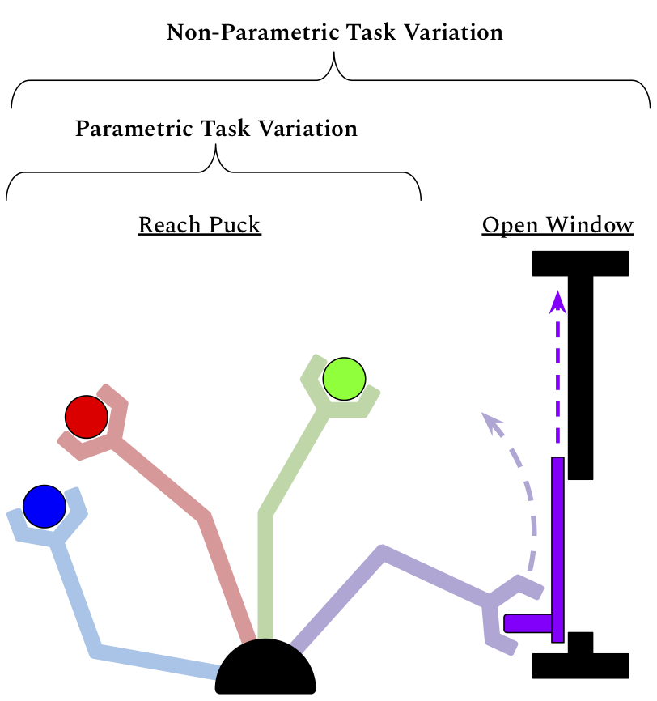
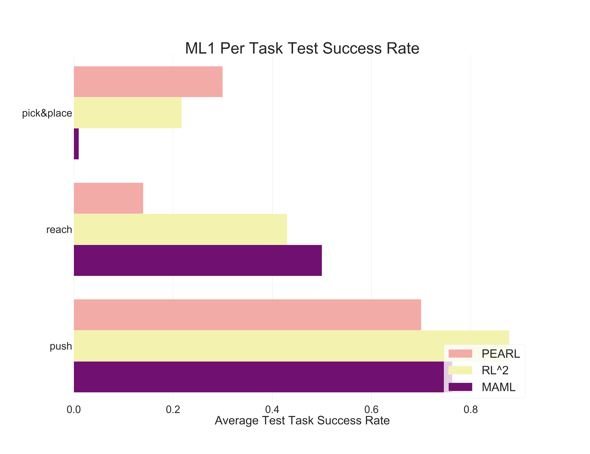
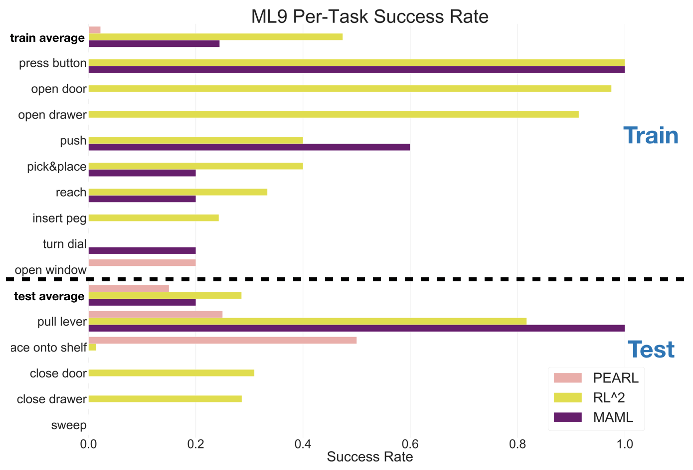
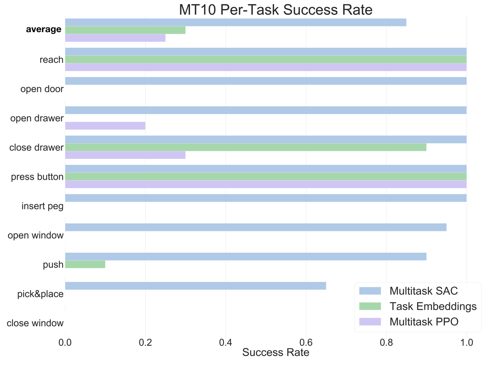
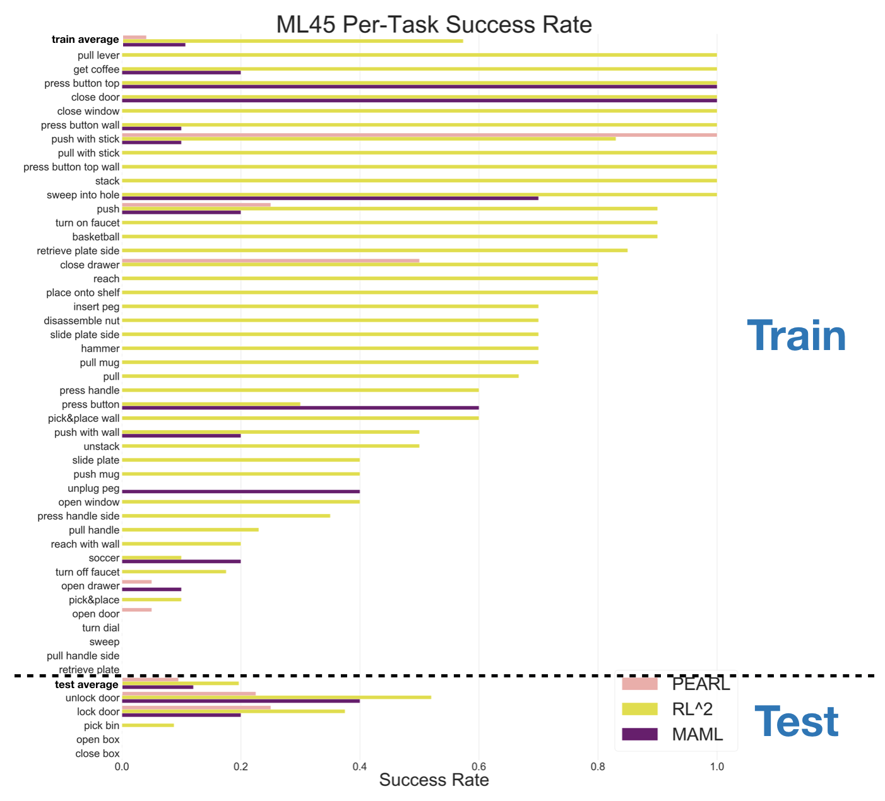
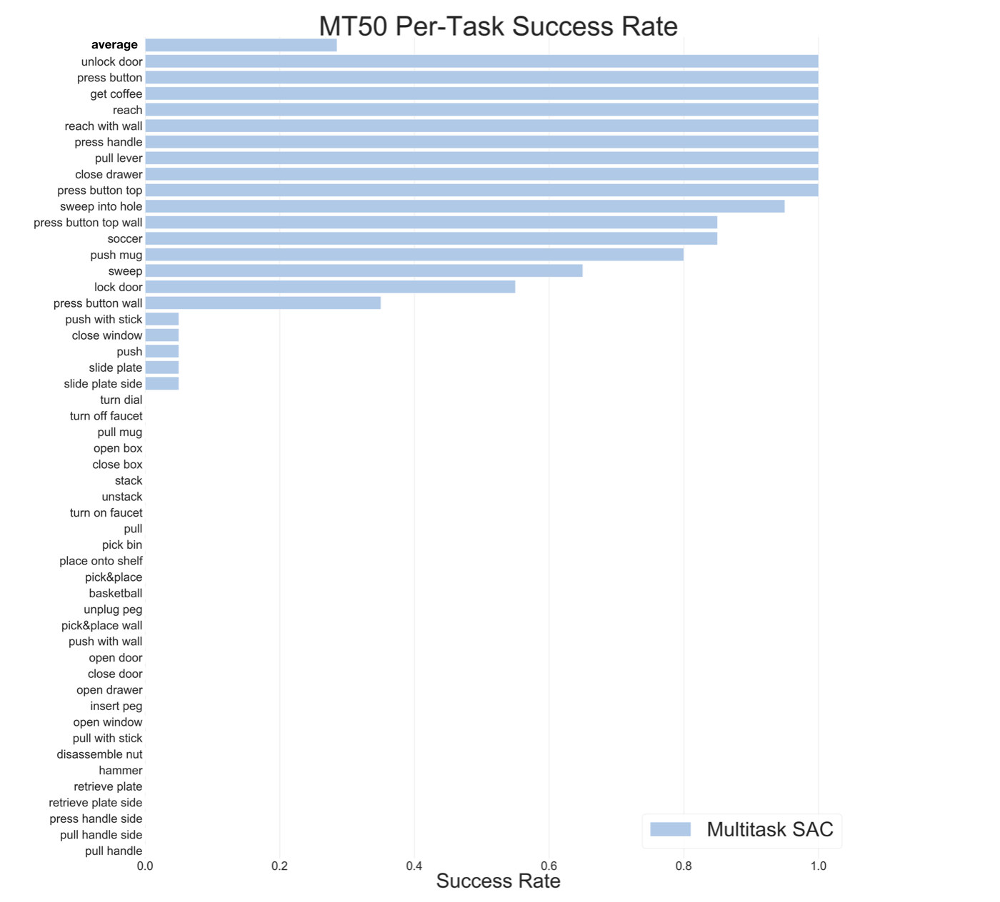
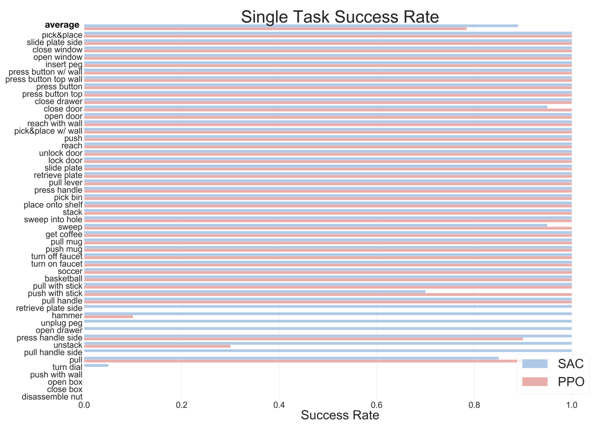
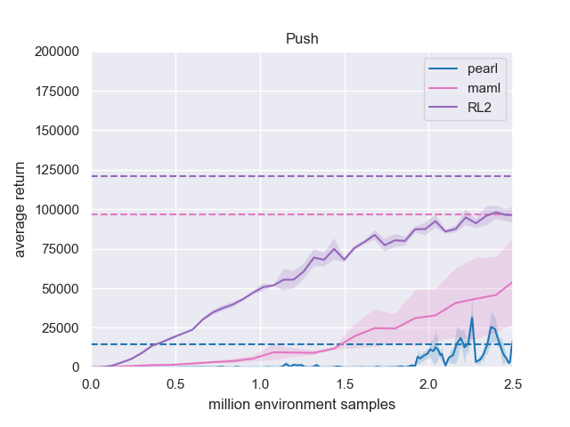
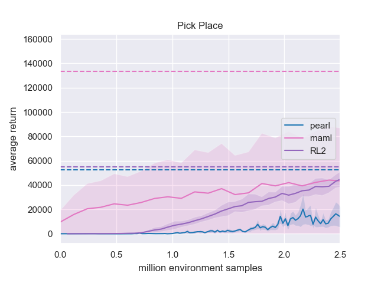

# Meta-World: A Benchmark and Evaluation for Multi-Task and Meta- Reinforcement Learning

###### ML45 Benchmark

Meta-World contains 50 manipulation tasks, designed to be diverse yet carry shared structure that can be leveraged for efficient multi-task RL and transfer to new tasks via meta-RL. In the most difficult evaluation, the method must use experience from 45 training tasks (left) to quickly learn distinctly new test tasks.

## Abstract
Meta-reinforcement learning algorithms can enable robots to acquire new skills much more quickly, by leveraging prior experience to learn how to learn. However, much of the current research on meta-reinforcement learning focuses on task distributions that are very narrow. For example, a commonly used meta-reinforcement learning benchmark uses different running velocities for a simulated robot as different tasks. When policies are meta-trained on such narrow task distributions, they cannot possibly generalize to more quickly acquire entirely new tasks. Therefore, if the aim of these methods is enable faster acquisition of entirely new behaviors, we must evaluate them on task distributions that are sufficiently broad to enable generalization to new behaviors. In this paper, we propose an open-source simulated benchmark for meta-reinforcement learning and multi-task learning consisting of 50 distinct robotic manipulation tasks, with the aim of making it possible to develop algorithms that generalize to accelerate the acquisition of entirely new, held-out tasks. We evaluate 6 state-of-the-art meta-reinforcement learning and multi-task learning algorithms on these tasks. Surprisingly, while each task and its variations (e.g., with different object positions) can be learned with reasonable success, these algorithms struggle to learn with multiple tasks at the same time, even with as few as nine distinct training tasks. Our analysis and open-source environments pave the way for future research in multi-task learning and meta-learning that can enable meaningful generalization, thereby unlocking the full potential of these methods.

## About the Benchmark

Visualization of three of our multi-task and meta-learning evaluation protocols, ranging from within task adaptation in ML1, to multi-task training across 10 distinct task families in MT10, to adapting to new tasks in ML9. Our most challenging evaluation mode ML45 is shown [above](#ml45-benchmark).

### Parametric vs Non-Parametric Variation

Parametric/non-parametric variation: all "reach puck tasks (left) can be parameterized by the puck position, while the difference between "reach puck" and "open window" (right) is non-parametric.

## Results

### ML1

Comparison on the simplest meta-RL evaluation, ML1, which requires adapting to new object and goal positions within one task. This simple evaluation already presents a challenge for current methods, providing room for improvement in future research.

### ML9

### MT10

### ML45

### MT50

### Single-Task Performance

Performance of independent policies trained on individual tasks using soft actor-critic (SAC) and proximal policy optimization (PPO). We verify that nearly all of the tasks are solvable by these algorithms.

Comparison of PEARL, MAML, and RL$^2$ learning curves on the simplest evaluation, ML1, where the methods need to adapt quickly to new object and goal positions within the one meta-training task.

## Get the Code
Code for the benchmark environments is available on our [anonymous submission GitHub account here](https://github.com/corl2019metaworld/metaworld).

We will publicly post and maintain the code as an open source project after publication.
